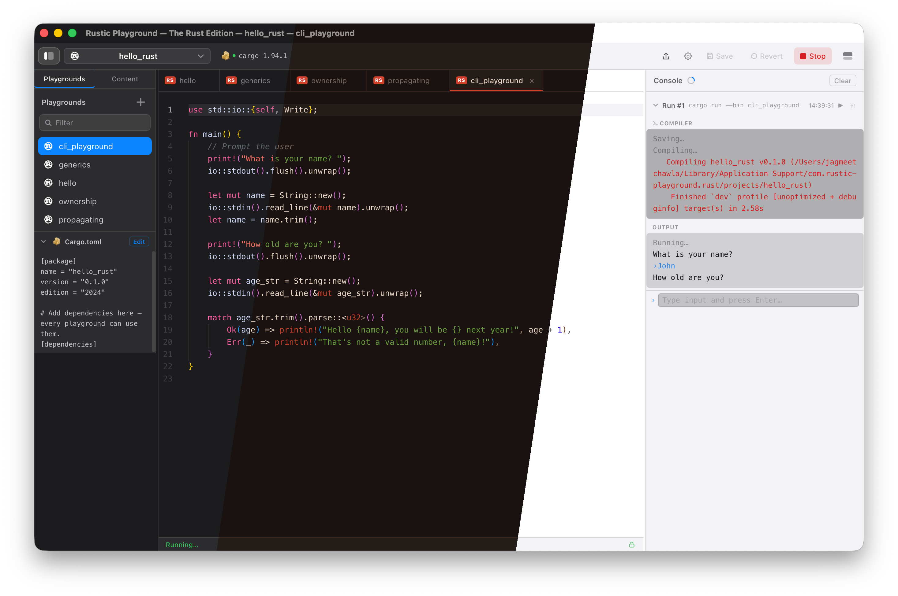

<p align="center">
  
  <br><br>
  <strong style="font-size: 1.5em;">Rustic Playground</strong>
  <br><br>
  A <b>native</b> macOS playground for <b>Rust</b> — write code, press <b>⌘R</b>, watch output stream live.<br>
  Real <code>cargo</code> projects with real crates, your own <code>rustup</code> toolchains, fully offline. No terminal required.
  <br><br>
  Built with <a href="https://www.rust-lang.org">Rust</a> + <a href="https://tauri.app">Tauri 2</a> + <a href="https://svelte.dev">Svelte 5</a> + <a href="https://microsoft.github.io/monaco-editor/">Monaco Editor</a>.
  <br><br>
  <a href="https://rusticplayground.dev">Website</a> ·
  <a href="https://discord.gg/AqPUgNfb">Discord</a> ·
  <a href="https://github.com/jagmeetchawla/rustic-playground/releases">Releases</a>
  <br><br>
  
  <br>
  <sub>Dark · Rust · Light</sub>
</p>

<br>

> [!WARNING]
> ## ⚠️ DEVELOPER TOOL — NOT SANDBOXED — USE AT YOUR OWN RISK
>
> **This application is intentionally NOT sandboxed.**
>
> Like Xcode, VS Code, and Terminal, it must run outside macOS's App Sandbox
> because it compiles and executes arbitrary code using your local
> Rust toolchain (`cargo`).
>
> **This means:**
> - Any code you write and run has **full access to your filesystem, network,
>   processes, and environment** — the same as code you'd run in Terminal
> - There is **no isolation** between playground code and your system
> - A playground that deletes files, exfiltrates data, or forks a bomb will
>   actually do those things
>
> **Official builds are code-signed & notarized.** The DMGs on our
> [Releases](https://github.com/jagmeetchawla/rustic-playground/releases) page
> and the Homebrew cask are signed by CloudCraft AI Labs and notarized by
> Apple. **Only install from those sources** — don't run a pre-built binary
> from anywhere else. Prefer to build it yourself? The source is right here.
>
> **You are responsible for the code you run.** This tool is for learning
> and experimentation in a controlled environment you own.

## Install

> **The prebuilt download is the Rust Edition (`rustic-rust`) — Rust only.** It's the only edition distributed as a signed binary. Support for other languages (C/C++, Zig, Swift) is experimental and source-build only — see [Other Languages](#other-languages-experimental).

Install the latest signed & notarized build with [Homebrew](https://brew.sh):

```sh
brew install --cask cloudcraft-ai/tap/rustic-rust
```

Or download the `.dmg` directly from [Releases](https://github.com/jagmeetchawla/rustic-playground/releases).

> The prebuilt DMG and Homebrew cask are **Apple Silicon only** (macOS 12+). An Intel build isn't available yet — building [from source](#build--run) on Intel may work but is currently untested.

Runs entirely on your machine against your own toolchains — no analytics or telemetry. The only network request the app makes on its own is a version check against GitHub Releases.

## Features

- **Multi-version toolchain picker** — switch between installed Rust toolchains straight from the toolbar pill (stable, beta, nightly, or specific versions); per-project pins via `rust-toolchain.toml`; install new toolchains in-app via streaming `rustup install`.
- **Guided toolchain install & repair** — detects Xcode CLT + Rust toolchain state on launch; two paths: "Help Me Install" (guided, in-app) or "I'll Do It Myself" (Terminal commands with copy-to-clipboard). No terminal needed for a complete Rust setup from scratch.
- **Welcome Wizard** — first-launch setup: checks your toolchain, sets a theme, and loads the Rust Book.
- **Live execution** — ⌘R compiles and runs; stdout/stderr streams in real time
- **Interactive console** — playgrounds that use `stdin` get a live input field in the Console panel
- **Live error checking** — `cargo check` squiggles in the editor
- **Multiple projects** — each project is an isolated Cargo workspace with its own config
- **Multiple playgrounds** — each file in `src/bin/` is its own runnable binary
- **Dependency management** — edit `Cargo.toml` directly or add/remove crates from the toolbar
- **Content files** — attach any file to a project via the Files panel; access at runtime via the `PLAYGROUND_CONTENT` env var
- **Playground templates** — starter templates with auto-added dependencies
- **Book examples** — the Rust Book (20 chapters, 40+ playgrounds) as read-only, copy-to-run projects — load via the **Learn** menu
- **Themes** — System, Light, Dark, and a dedicated Rust theme, with automatic light/dark matching
- **Settings panel** — font size, font family, tab size, toolchain paths (⌘,)
- **Console improvements** — copy button, ANSI color support, timestamps
- **Window state persistence** — layout, panel sizes, open tabs, and window size survive restarts

## Requirements

| Tool | Version |
|---|---|
| macOS | 12 Monterey or later |
| Xcode Command Line Tools | Required — Rust needs Apple's `cc` linker and SDK to build on macOS |
| Rust toolchain | stable **1.85+** (edition 2024 floor) — install via [rustup.rs](https://rustup.rs) |
| Node.js | 18+ |
| pnpm | 8+ |
| Tauri CLI | `cargo install tauri-cli --version "^2.0"` |

> **Note:** On a Mac without developer tools, macOS may show an "Install Command Line Developer Tools" dialog on first launch. This is triggered by macOS (Apple's WebKit framework), not by the app. You can dismiss it — the app will guide you through installation when you're ready.

## Build & Run

```sh
git clone https://github.com/jagmeetchawla/rustic-playground
cd rustic-playground
cd ui && pnpm install && cd ..
```

Build and run the Rust Edition:
```sh
VITE_EDITION=rust cargo tauri dev --config editions/rust.json       # dev mode
VITE_EDITION=rust cargo tauri build --config editions/rust.json     # release DMG
```

> Other languages ship in a separate, experimental build — see [Other Languages](#other-languages-experimental).
> See [`specs/build-helper.md`](specs/build-helper.md) for the full build guide: version management, edition configs, icon generation, troubleshooting.

## How It Works

Each **project** is a Cargo package, stored at:

```
~/Library/Application Support/com.rustic-playground.rust/projects/<name>/
├── Cargo.toml     ← dependencies shared by the project's playgrounds
├── src/bin/       ← each playground is a standalone binary (<name>.rs)
└── content/       ← runtime assets (accessible via the PLAYGROUND_CONTENT env var)
```

Each playground is a standalone `fn main()` in `src/bin/`. Press **⌘R** and the
backend runs it with `cargo run --bin <name>` against your selected toolchain,
streaming stdout/stderr live.

## User Guide

Press **⌘⇧/** in the app for the full user guide — an Apple-style help panel covering
all languages, playgrounds, projects, console, content files, keyboard shortcuts, book
examples, and security. The same content will be available on the website and wiki.

## Keyboard Shortcuts

| Shortcut | Action |
|---|---|
| ⌘R | Run the active playground |
| ⌘. | Stop the running process |
| ⌘S | Save the active file |
| ⌘N | New playground |
| ⌘W | Close active tab |
| ⌘, | Settings |
| ⌘⇧N | New project |
| ⌘⇧/ | Help |

## Book Examples

Load curated example projects via the **Learn** menu or the Welcome Wizard:

| Book | Chapters | Source |
|---|---|---|
| **The Rust Book** | 20 chapters, 40+ playgrounds | Based on [_The Rust Programming Language_](https://doc.rust-lang.org/book/) |

Book projects are **read-only** — use "Copy to Project" to experiment with any example.
Each chapter project contains an `attribution.md` in its Files panel.

> **Attribution** — Playground code is original educational material, not verbatim from the book.
> Rustic Playground is not affiliated with or endorsed by the Rust Project.

_(The experimental Power Edition also bundles K&R C and Swift book examples — see [Other Languages](#other-languages-experimental).)_

## Project Structure

```
rustic-playground/
├── src-tauri/
│   ├── src/
│   │   ├── lib.rs                ← app state, config, settings, entry point
│   │   ├── languages/            ← per-language modules (rust, clang, zig, swift)
│   │   ├── playground_commands.rs ← CRUD + run/kill via Lang enum dispatch
│   │   ├── cargo_commands.rs     ← toolchain checks, wizard, Cargo.toml management
│   │   ├── content_commands.rs   ← content file CRUD
│   │   ├── export.rs             ← project export (per-language)
│   │   └── menu.rs              ← macOS menu bar builder
│   ├── capabilities/             ← Tauri 2 permission definitions
│   └── tauri.conf.json
└── ui/
    └── src/
        ├── App.svelte            ← root layout, all global state, menu events
        ├── app.css               ← theme definitions (8 themes)
        └── lib/
            ├── Sidebar.svelte
            ├── Editor.svelte
            ├── Output.svelte
            ├── ProjectSwitcher.svelte
            ├── ToolchainWizard.svelte  ← Welcome Wizard + Settings
            ├── NewPlaygroundModal.svelte
            ├── CopyToProjectModal.svelte
            ├── HelpModal.svelte
            ├── AboutModal.svelte
            └── languages.ts      ← language registry
```

## Security Model

See the warning at the top of this file. Additionally:

- Playground names are validated as `[a-z][a-z0-9_]*` — path traversal is blocked at the API layer
- The Tauri IPC bridge only accepts calls from the app's own WebView origin
- `cargo` is invoked via its absolute path (`~/.cargo/bin/cargo`), not via shell string interpolation
- Playground runs use a separate `target/playground-runs/` directory to avoid lock conflicts

## Release History

| Version | Highlights |
|---|---|
| v0.4 | Multi-version Rust toolchain picker — pill dropdown lists every installed rustup toolchain with `✓` on the effective one and `📌` on the project's pinned one. Per-project pins via `rust-toolchain.toml` with a warning row when the pinned toolchain isn't installed. "Install newer stable?" hint compares the latest known stable against toolchains on _any_ channel, so users on nightly aren't nagged. In-app Install Toolchain dialog streams `rustup install` for stable/beta/nightly/specific versions. New Rust templates: **let-chains** (1.88+), **let-else**, **modern std tour** (`is_some_and`, `inspect`, `windows`), and **System Info** diagnostic (dumps rustc/cargo/target/env). The Rust Toolchain modal now lists all installed toolchains regardless of entry point (pill, Help menu, Settings) |
| v0.3.6 | New app icon (richer illustrated artwork across app, website, in-app modals). DMG polish — mounted volume shows macOS's default disk icon instead of duplicating the app icon, making drag-to-Applications clearer. Code-signing certificate re-issued (Team ID unchanged). Notarize + staple automated in the build pipeline via `NOTARIZE=1` |
| v0.3.5 | Rust toolchain version gate — enforces rustc ≥ 1.85 (edition 2024 floor), yellow toolchain pill when outdated, in-app "Update Rust" button runs `rustup update stable && rustup default stable` with streamed output, manual-mode copy-paste command for Terminal users |
| v0.3.4 | In-app Rust toolchain installer & repair with guided + manual install paths, Xcode CLT detection as prerequisite, FixWizard split layout with auto-polling, Help menu restructure (Website, GitHub, Rust Help, Rust Book top-level), Rust Toolchain help section, toolchain step skip indicator, code-signed + notarized DMG distribution |
| v0.3.3 | Edition builds — Rust Edition, C Edition, Power Edition as separate DMGs from one codebase. Saved snapshots with revert, run lifecycle status, update checker, language logos, dynamic window title |
| v0.3.2 | Welcome Wizard (5-step first-launch), language gating, per-language hello projects, native→clang rename, Apple HIG styling, dual-mode settings/wizard, book management via checkboxes, toolchain pill status |
| v0.3.1 | Read-only book projects, per-playground locking, Copy to Project, Learn menu, flyout submenus, Zig/Swift themes, auto theme matching, theme dropdown |
| v0.3 | Language module architecture (Lang enum dispatch), Zig + Swift project types, Swift Book examples, frontend language registry |
| v0.2 | Clang C/C++ projects, rustic.toml manifest, K&R C Book examples, sea green theme, compiler flags UI, Clang export |
| v0.1.9 | Renamed from playground-rs to rustic-playground |
| v0.1.8 | App icon, Rust theme, live error checking, dark/light/system themes, project export, backend modularization, 70 unit tests |
| v0.1.7 | Settings panel, toolchain wizard, dependency manager, 11 templates, console improvements |
| v0.1.6 | Help/About modals, window state persistence, resizable panels, stop button |
| v0.1.5 | Content files, drag-and-drop import, project management |
| v0.1.0 | Initial release — sidebar, editor, live output streaming |

## Other Languages (Experimental)

Rustic Playground started as a multi-language playground, and the codebase still
carries **experimental** support for other toolchains. These do **not** ship in
the Rust Edition download — to try them, build the **Power Edition** from source:

```sh
VITE_EDITION=power cargo tauri build --config editions/power.json
```

| Language | Toolchain | Install |
|---|---|---|
| C/C++ | Clang (via Xcode Command Line Tools) | `xcode-select --install` |
| Zig | **0.15.x** (other versions may have breaking API changes) | `brew install zig` |
| Swift | swiftc (via Xcode Command Line Tools) | `xcode-select --install` |

The Power Edition also bundles the **K&R C** and **Swift** book examples. Each
edition is fully isolated — its own app name, bundle ID, and data directory — so
it installs alongside the Rust Edition. These languages are unpolished and
source-build only; the Rust Edition is the supported product.

## License

[MIT](LICENSE) © 2026 Jagmeet Chawla. Feedback and PRs welcome.
