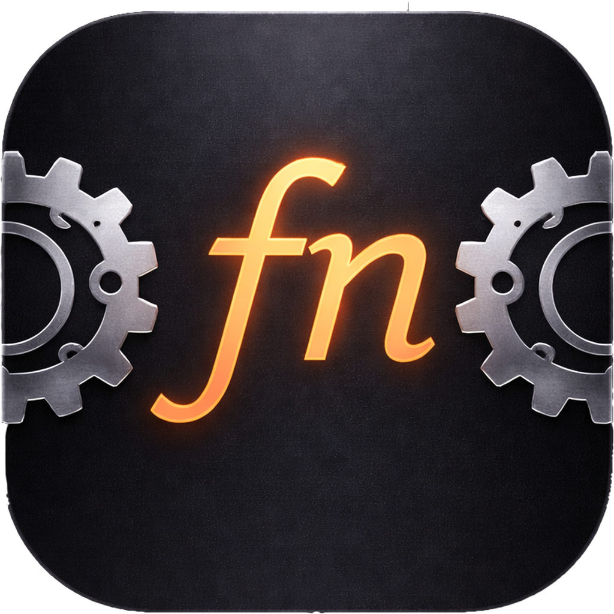
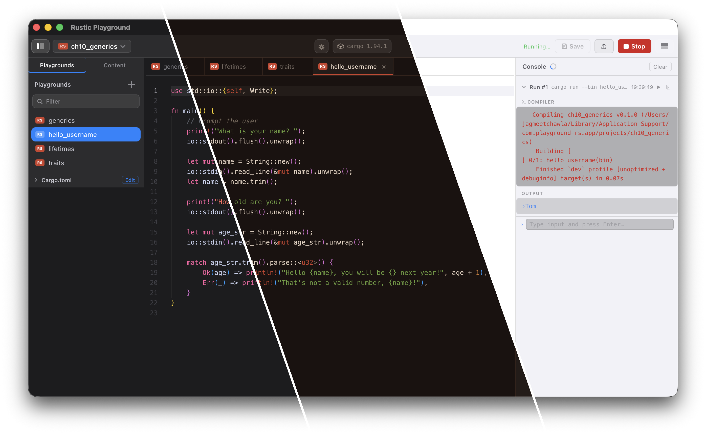

<p align="center">
  
  <br><br>
  <strong style="font-size: 1.5em;">Rustic Playground</strong>
  <br><br>
  A macOS desktop app for running code experiments — inspired by Swift Playgrounds.<br>
  Supports <b>Rust</b>, <b>C/C++</b>, <b>Zig (v0.15)</b>, and <b>Swift</b>.<br>
  Write code, press <b>⌘R</b>, see output stream live. No terminal required.
  <br><br>
  Built with <a href="https://www.rust-lang.org">Rust</a> + <a href="https://tauri.app">Tauri 2</a> + <a href="https://svelte.dev">Svelte 5</a> + <a href="https://microsoft.github.io/monaco-editor/">Monaco Editor</a>.
  <br><br>
  
  <br>
  <sub>Dark · Rust · Light</sub>
</p>

<br>

> [!WARNING]
> ## ⚠️ DEVELOPER TOOL — NOT SANDBOXED — USE AT YOUR OWN RISK
>
> **This application is intentionally NOT sandboxed.**
>
> Like Xcode, VS Code, and Terminal, it must run outside macOS's App Sandbox
> because it compiles and executes arbitrary code using your local
> toolchains (`cargo`, `clang`, `zig`, `swiftc`).
>
> **This means:**
> - Any code you write and run has **full access to your filesystem, network,
>   processes, and environment** — the same as code you'd run in Terminal
> - There is **no isolation** between playground code and your system
> - A playground that deletes files, exfiltrates data, or forks a bomb will
>   actually do those things
>
> **No binary is distributed.** You must compile this yourself from source.
> If you received a pre-built binary from an untrusted source, do not run it.
>
> **You are responsible for the code you run.** This tool is for learning
> and experimentation in a controlled environment you own.

## Features

- **Multi-language** — Rust, C/C++ (Clang), Zig, and Swift project types
- **Welcome Wizard** — 5-step first-launch setup: choose languages, check toolchains, set theme, load books
- **Language gating** — only enabled languages appear in menus, project switcher, and settings
- **Live execution** — ⌘R compiles and runs; stdout/stderr streams in real time
- **Interactive console** — playgrounds that use `stdin` get a live input field in the Console panel
- **Multiple projects** — each project is an isolated workspace with its own config
- **Multiple playgrounds** — each file is its own runnable binary
- **Content files** — attach any file to a project via the Files panel; access at runtime via the `PLAYGROUND_CONTENT` env var
- **Dependency management** — edit Cargo.toml directly or add/remove crates from the toolbar
- **Playground templates** — starter templates per language with auto-deps
- **8 themes** — System, Light, Dark, Auto (match language), Rust, Clang, Zig, Swift
- **Settings panel** — font size, font family, tab size, toolchain paths, language management (⌘,)
- **Console improvements** — copy button, ANSI color support, timestamps
- **Window state persistence** — layout, panel sizes, open tabs, and window size survive restarts
- **Book examples** — Rust Book (20 chapters), K&R C Book (8 chapters), Swift Book (8 chapters) — load via **Learn** menu
- **Read-only books** — book projects are non-editable reference material; "Copy to Project" to experiment
- **Live error checking** — cargo check squiggles in the editor for Rust projects

## Requirements

| Tool | Version |
|---|---|
| macOS | 13 Ventura or later |
| Rust toolchain | stable — install via [rustup.rs](https://rustup.rs) |
| Node.js | 18+ |
| pnpm | 8+ |
| Tauri CLI | `cargo install tauri-cli --version "^2.0"` |

**Optional language toolchains** (for non-Rust projects):

| Language | Toolchain | Install |
|---|---|---|
| C/C++ | Clang (via Xcode CLI Tools) | `xcode-select --install` |
| Zig | **0.15.x** (other versions may have breaking API changes) | `brew install zig` |
| Swift | swiftc (via Xcode CLI Tools) | `xcode-select --install` |

## Build & Run

```sh
git clone https://github.com/jagmeetchawla/rustic-playground
cd rustic-playground
```

**macOS desktop app** (Tauri + Svelte):
```sh
cd ui && pnpm install && cd ..
cargo tauri dev        # development mode — hot reload
cargo tauri build      # release .app + .dmg in src-tauri/target/release/bundle/
```

**CLI runner** (no GUI, no Node required):
```sh
cargo run              # interactive playground picker
cargo run -- <name>    # run a specific playground
cargo build            # build all playgrounds
```

## How It Works

Each **project** is stored at:

```
~/Library/Application Support/com.rustic-playground.app/projects/<name>/
├── Cargo.toml / rustic.toml  ← project config (Rust uses Cargo.toml, others use rustic.toml)
├── src/bin/ or src/           ← playground files (.rs, .c, .cpp, .zig, .swift)
└── content/                   ← runtime assets (accessible via PLAYGROUND_CONTENT)
```

Each file is a standalone program with a `main` function.
The backend compiles and runs it using the appropriate toolchain (cargo, clang, zig, swiftc) and streams output live.

## User Guide

Press **⌘⇧/** in the app for the full user guide — an Apple-style help panel covering
all languages, playgrounds, projects, console, content files, keyboard shortcuts, book
examples, and security. The same content will be available on the website and wiki.

## Keyboard Shortcuts

| Shortcut | Action |
|---|---|
| ⌘R | Run the active playground |
| ⌘. | Stop the running process |
| ⌘S | Save the active file |
| ⌘N | New playground |
| ⌘W | Close active tab |
| ⌘, | Settings |
| ⌘⇧N | New project |
| ⌘⇧/ | Help |

## Book Examples

Load curated example projects via the **Learn** menu or the Welcome Wizard:

| Book | Chapters | Language | Source |
|---|---|---|---|
| **The Rust Book** | 20 chapters, 40+ playgrounds | Rust | Based on [_The Rust Programming Language_](https://doc.rust-lang.org/book/) |
| **The K&R C Book** | 8 chapters, 16 playgrounds | C/C++ | Based on _The C Programming Language_ by Kernighan & Ritchie |
| **The Swift Book** | 8 chapters, 14 playgrounds | Swift | Based on [_The Swift Programming Language_](https://docs.swift.org/swift-book/) |

Book projects are **read-only** — use "Copy to Project" to experiment with any example.
Each chapter project contains an `attribution.md` in its Files panel.

> **Attribution** — Playground code is original educational material, not verbatim from the books.
> Rustic Playground is not affiliated with or endorsed by the Rust Project, Apple, or the original authors.

## Project Structure

```
rustic-playground/
├── src-tauri/
│   ├── src/
│   │   ├── lib.rs                ← app state, config, settings, entry point
│   │   ├── languages/            ← per-language modules (rust, clang, zig, swift)
│   │   ├── playground_commands.rs ← CRUD + run/kill via Lang enum dispatch
│   │   ├── cargo_commands.rs     ← toolchain checks, wizard, Cargo.toml management
│   │   ├── content_commands.rs   ← content file CRUD
│   │   ├── export.rs             ← project export (per-language)
│   │   └── menu.rs              ← macOS menu bar builder
│   ├── capabilities/             ← Tauri 2 permission definitions
│   └── tauri.conf.json
└── ui/
    └── src/
        ├── App.svelte            ← root layout, all global state, menu events
        ├── app.css               ← theme definitions (8 themes)
        └── lib/
            ├── Sidebar.svelte
            ├── Editor.svelte
            ├── Output.svelte
            ├── ProjectSwitcher.svelte
            ├── ToolchainWizard.svelte  ← Welcome Wizard + Settings
            ├── NewPlaygroundModal.svelte
            ├── CopyToProjectModal.svelte
            ├── HelpModal.svelte
            ├── AboutModal.svelte
            └── languages.ts      ← language registry
```

## Security Model

See the warning at the top of this file. Additionally:

- Playground names are validated as `[a-z][a-z0-9_]*` — path traversal is blocked at the API layer
- The Tauri IPC bridge only accepts calls from the app's own WebView origin
- `cargo` is invoked via its absolute path (`~/.cargo/bin/cargo`), not via shell string interpolation
- Playground runs use a separate `target/playground-runs/` directory to avoid lock conflicts

## Release History

| Version | Highlights |
|---|---|
| v0.3.4 | _(planned)_ Linux port — native GTK4/Vala app with .deb and .rpm packaging |
| v0.3.3 | _(in progress)_ Edition builds — Rust Edition, C Edition, Power Edition as separate DMGs from one codebase |
| v0.3.2 | Welcome Wizard (5-step first-launch), language gating, per-language hello projects, native→clang rename, Apple HIG styling, dual-mode settings/wizard, book management via checkboxes, toolchain pill status |
| v0.3.1 | Read-only book projects, per-playground locking, Copy to Project, Learn menu, flyout submenus, Zig/Swift themes, auto theme matching, theme dropdown |
| v0.3 | Language module architecture (Lang enum dispatch), Zig + Swift project types, Swift Book examples, frontend language registry |
| v0.2 | Clang C/C++ projects, rustic.toml manifest, K&R C Book examples, sea green theme, compiler flags UI, Clang export |
| v0.1.9 | Renamed from playground-rs to rustic-playground |
| v0.1.8 | App icon, Rust theme, live error checking, dark/light/system themes, project export, backend modularization, 70 unit tests |
| v0.1.7 | Settings panel, toolchain wizard, dependency manager, 11 templates, console improvements |
| v0.1.6 | Help/About modals, window state persistence, resizable panels, stop button |
| v0.1.5 | Content files, drag-and-drop import, project management |
| v0.1.0 | Initial release — sidebar, editor, live output streaming |

## License

MIT
